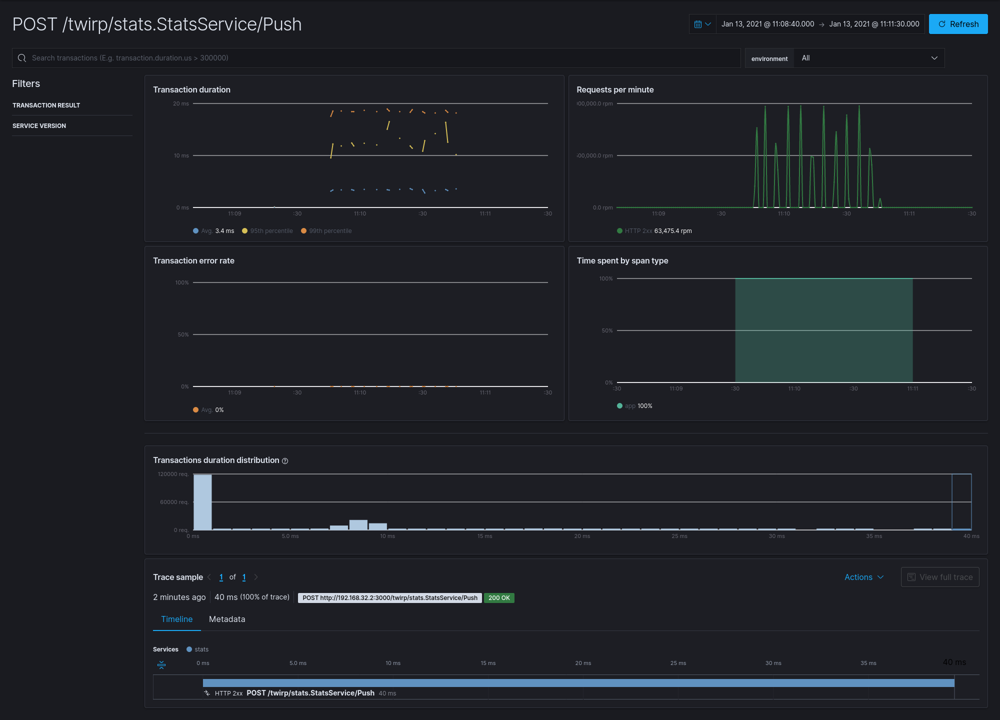

# Load Tests

## 1st Iteration

```sh
# ./test-benchmark-service.sh (d15s t4 c400)
Running 15s test @ http://192.168.176.2:3000/twirp/stats.StatsService/Push
  4 threads and 400 connections
  Thread Stats   Avg      Stdev     Max   +/- Stdev
    Latency    98.90ms  163.43ms   1.13s    91.93%
    Req/Sec     1.81k     1.09k    4.88k    76.83%
  108351 requests in 15.09s, 17.95MB read
  Socket errors: connect 0, read 0, write 0, timeout 8
  Non-2xx or 3xx responses: 60979
Requests/sec:   7179.14
Transfer/sec:      1.19MB
```

Out of `108351` requests we have `60979` non-2xx or 3xx responses.

APM: Exception stack trace

```
twirp error internal: dial tcp 192.168.176.5:3306: operation was canceled

twirp.go in NewServerHooks.func1 at line 14
stats.twirp.go in callError at line 1020
stats.twirp.go in writeError at line 559
stats.twirp.go in (*statsServiceServer).writeError at line 256
stats.twirp.go in (*statsServiceServer).servePushJSON at line 373
stats.twirp.go in (*statsServiceServer).servePush at line 316
stats.twirp.go in (*statsServiceServer).ServeHTTP at line 299
wrap.go in WrapWithIP.func1 at line 29
```

---

## 2nd Iteration

```sh
# ./test-benchmark-service.sh (d15s t4 c400)
Running 15s test @ http://192.168.240.3:3000/twirp/stats.StatsService/Push
  4 threads and 400 connections
  Thread Stats   Avg      Stdev     Max   +/- Stdev
    Latency   150.09ms  190.97ms   1.94s    88.03%
    Req/Sec     0.99k   691.65     2.78k    58.19%
  59292 requests in 15.10s, 6.60MB read
  Socket errors: connect 0, read 0, write 0, timeout 1
  Non-2xx or 3xx responses: 3078
Requests/sec:   3927.27
Transfer/sec:    447.51KB
```

Out of `59292` requests we still have `3078` non-2xx or 3xx responses and stack traces like `twirp error internal: context canceled`

---

## 3rd Iteration

```sh
# ./test-benchmark-service.sh (d60s t4 c100)
Running 1m test @ http://172.22.0.2:3000/twirp/stats.StatsService/Push
  4 threads and 100 connections
  Thread Stats   Avg      Stdev     Max   +/- Stdev
    Latency    20.09ms    8.38ms 196.03ms   90.40%
    Req/Sec     1.27k   242.35     1.79k    70.96%
  304527 requests in 1.00m, 31.66MB read
Requests/sec:   5067.03
Transfer/sec:    539.36KB
```

---

## 4rd Iteration

```sh
# ./test-benchmark-service.sh (d60s t4 c100)
Running 1m test @ http://172.26.0.2:3000/twirp/stats.StatsService/Push
  4 threads and 100 connections
  Thread Stats   Avg      Stdev     Max   +/- Stdev
    Latency     5.13ms    5.47ms 108.96ms   86.70%
    Req/Sec     6.39k   594.54     9.31k    77.46%
  1527397 requests in 1.00m, 158.77MB read
Requests/sec:  25434.90
Transfer/sec:      2.64MB
```

We got more (5x) throughput but SQL traces disappeared in APM transactions view.



## Load Tests Haberdasher Servie

```sh
$(go env GOPATH)/bin/hey \
	-h2 \
	-T 'application/json' \
	-d '{"centimeters": 59}' \
	-m POST \
	-z 15s \
	http://172.29.0.2:3000/twirp/tullo.microservice.haberdasher.HaberdasherService/MakeHat
```

```text
Summary:
  Total:	15.0150 secs
  Slowest:	0.1128 secs
  Fastest:	0.0059 secs
  Average:	0.0164 secs
  Requests/sec:	3048.2246
  
  Total data:	2009798 bytes
  Size/request:	43 bytes

Response time histogram:
  0.006 [1]	|
  0.017 [26926]	|■■■■■■■■■■■■■■■■■■■■■■■■■■■■■■■■■■■■■■■■
  0.027 [18326]	|■■■■■■■■■■■■■■■■■■■■■■■■■■■
  0.038 [265]	|
  0.049 [58]	|
  0.059 [95]	|
  0.070 [11]	|
  0.081 [10]	|
  0.091 [9]	|
  0.102 [57]	|
  0.113 [11]	|


Latency distribution:
  10% in 0.0122 secs
  25% in 0.0140 secs
  50% in 0.0159 secs
  75% in 0.0181 secs
  90% in 0.0204 secs
  95% in 0.0223 secs
  99% in 0.0277 secs

Details (average, fastest, slowest):
  DNS+dialup:	0.0000 secs, 0.0059 secs, 0.1128 secs
  DNS-lookup:	0.0000 secs, 0.0000 secs, 0.0000 secs
  req write:	0.0000 secs, 0.0000 secs, 0.0011 secs
  resp wait:	0.0163 secs, 0.0058 secs, 0.1128 secs
  resp read:	0.0000 secs, 0.0000 secs, 0.0012 secs

Status code distribution:
  [200]	45769 responses
```

----
